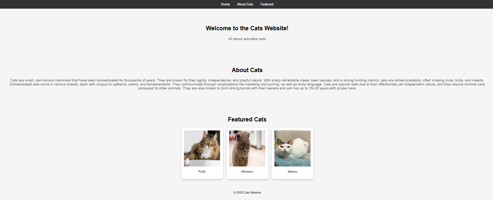

# css-animation

## 📌 Description
The Cats Website is a basic webpage that provides information about cats and showcases featured feline friends through interactive cards. It's designed with HTML, CSS, and animations to create an engaging user experience.

## 🛠 Prerequisites
N/A

## 📋 Criteria
* Responsive design for different screen sizes
* Smooth animations for better user experience
* Organised and readable HTML & CSS
* Easy-to-navigate sections: Home, About Cats, and Featured Cats

## 💻 Technologies Used
The application is built with the following technologies:
* HTML
* CSS
* Flexbox
* CSS Animations
 
## 🚀 Installation
No installation is required to use the app. It is hosted online and can be accessed via a web browser.

## 📚 Usage
1. Navigation: Click the menu links (Home, About, Featured) to explore the site.
2. Hover Effects: Hover over cat cards to see interactive scaling.
3. Animations: Titles and cards animate into view for a smooth experience.

## 🔗 Live Demo & Repository
Application can be viewed here: 
* [Live](https://yvonnesarah.github.io/css-animation/)

* [Repository](https://github.com/yvonnesarah/css-animation)

## 🖼 Screenshot
Below is a preview of Cats Animation:

## 👥 Credit
N/A

## 📜 License
This project is open-source. For licensing details, please refer to the LICENSE file in the repository.

## 📬 Contact
You can reach me at 📧 yvonneadedeji.sarah@gmail.com.
